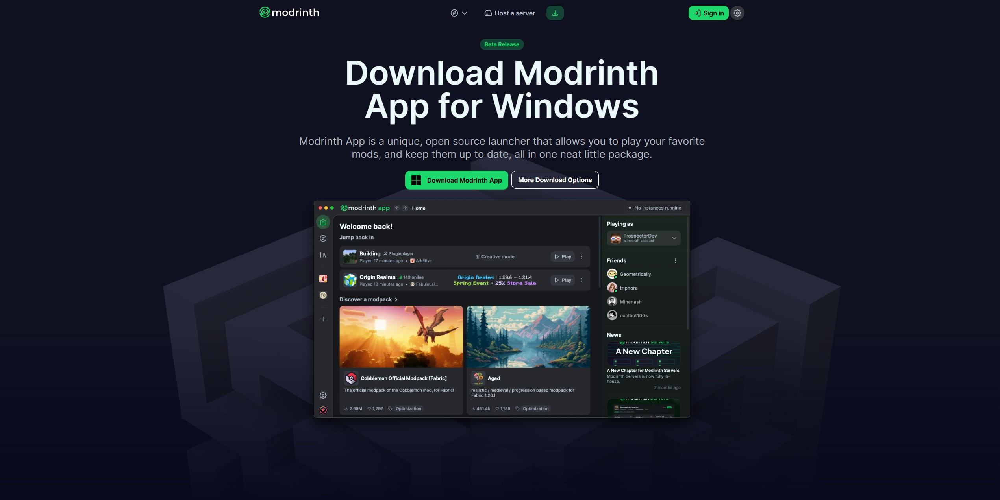
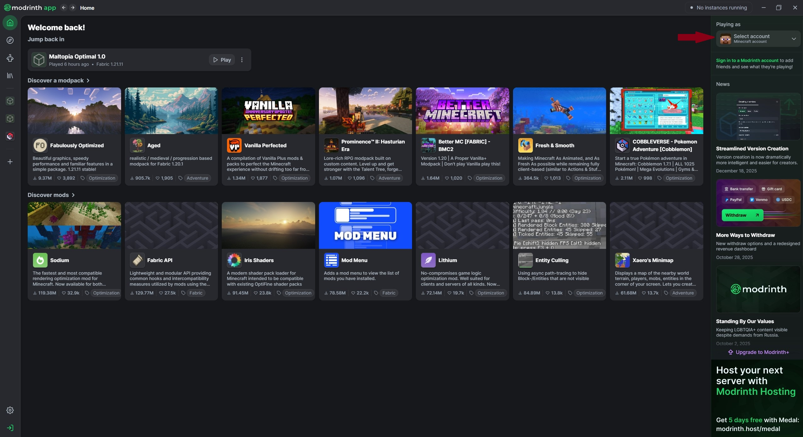
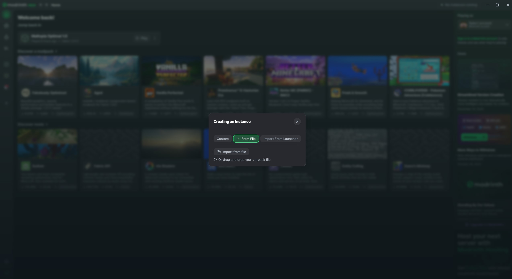
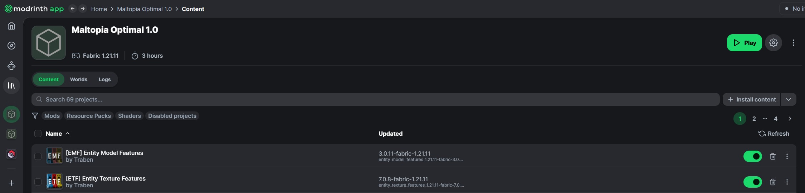

# 📥 How to Join Maltopia

Follow these steps to install the modpack using the **Modrinth App**. Since you have already downloaded the pack from our repository, this will only take a minute!

---

### 1. Download the Modrinth App
If you don't have it yet, download the official launcher here:
* **Download:** [modrinth.com/app](https://modrinth.com/app)

---

### 2. Log In
1.  Open the Modrinth App.
2.  Click **Log In** at the bottom left.
3.  Sign in with your **Microsoft Account** (Minecraft account).

---

### 3. Download Pack
Download the official `.mrpack` to use in Maltopia.

* **Download:** [Maltopia-Pack](https://modrinth.com/modpack/maltopia)

---

### 4. Import the Maltopia Pack
Instead of creating a new profile from scratch, we will use the file you downloaded:
1.  Click the **plus (+) icon** in the left sidebar (Create New Instance).
2.  At the top, select the **From file** tab.
3.  Click **Import from file** and select the `.mrpack` file you downloaded.
4.  Click **Create** at the bottom.

---

### 5. Launch & Play
1.  Once the progress bar finishes, click the **Play** button on the Maltopia instance.
2.  Go to **Multiplayer** and the server should already be in your list , or you can add `mc.maltopia.fun`!

---
**💡 Having Trouble?**
If the game crashes or you get a "Resource Reload Failed" message, please post a screenshot in the `#support` channel of our Discord or e-mail us at `support@maltopia.fun`!
